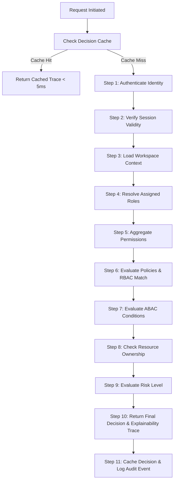

# 📐 PAL 11-Step Permission Evaluation Architecture

**Document ID**: PAL-ARCH-DOC-011  
**Governing Specs**: PAL Architecture Bible Chapters 23 & 24, PAL-TDD-001 Chapter 8  
**Component**: `PermissionEngine` (`lib/security/authorization/permissionEngine.ts`)  
**Status**: APPROVED & IMPLEMENTED  

---

## 1. Overview & Purpose

The **Permission Engine** executes a deterministic, 11-step evaluation pipeline for every request entering PAL. It enforces Zero Trust, hybrid RBAC + ABAC governance, tenant workspace isolation, decision caching (`ICacheProvider`), and complete decision explainability.

---

## 2. The 11-Step Evaluation Flow

### Granular Step Specifications:

| Step | Operation | Description & Logic |
|---|---|---|
| **Step 1** | **Authenticate Identity** | Verifies that `userId` is present and valid. Denies if unauthenticated. |
| **Step 2** | **Verify Session Validity** | Ensures active session status in `SessionManager`. |
| **Step 3** | **Load Workspace Context** | Verifies `workspaceId` context is present. Denies if workspace context is missing. |
| **Step 4** | **Resolve Assigned Roles** | Queries `RoleRepository` for active human and AI roles assigned to the identity. |
| **Step 5** | **Aggregate Permissions** | Aggregates all effective permissions from assigned roles via `PermissionRepository`. |
| **Step 6** | **Evaluate Policies (RBAC Match)** | Checks if Founder role exists (wildcard `*` override) or if required permission matches aggregated keys (`domain:resource:action` or wildcard `projects:*`). |
| **Step 7** | **Evaluate ABAC Conditions** | Executes `ABACEngine` checks: tenant isolation (`actorWorkspace == resourceWorkspace`), resource classification, and risk limits. |
| **Step 8** | **Check Resource Ownership** | Verifies resource owner boundaries for `restricted` classifications. |
| **Step 9** | **Evaluate Risk Level** | Evaluates risk scores against safety thresholds (`riskScore <= 80`). |
| **Step 10** | **Return Final Decision** | Produces a typed `PermissionEvaluationTrace` containing `decision` (`allow` / `deny`), `reason`, `executionTimeMs`, and `stepsCompleted`. |
| **Step 11** | **Audit Logging & Caching** | Caches decision in `ICacheProvider` (5-minute TTL) and publishes immutable audit log to `AuditRepository`. |

---

## 3. Decision Precedence & Conflict Resolution

- **Deny Precedence**: Any failure in Steps 1 through 9 produces an immediate `deny` decision, short-circuiting remaining steps.
- **Founder Override**: The `Founder` system role grants wildcard `*` permissions at Step 6, but **must still pass ABAC Tenant Isolation** at Step 7 to prevent cross-workspace leaks.
- **Cache Invalidation**: Role or permission modifications immediately flush relevant decision keys in `ICacheProvider`.

---

## 4. Performance & SLA

- **Cache Hit Latency**: `< 5 ms`
- **Cache Miss Evaluation Latency**: `< 50 ms` (p95 SLA)
