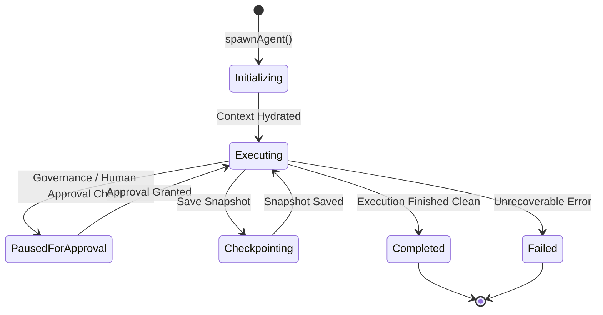

# 📚 PAL Architecture Specification — PAL-ARCH-DOC-021

## Agent Runtime Architecture

**Subsystem**: Agent Runtime Subsystem (`PAL-TDD-003`)  
**Governing Standard**: PAL Architecture Bible v1.0 (Chapters 23, 24 & 25)  
**Status**: **APPROVED ARCHITECTURE SPECIFICATION**  

---

## 1. Overview

The **Agent Runtime Architecture** defines the isolated execution environment, state machine, token budgeting, heartbeat monitoring, and cancellation protocol for worker agent instances.

---

## 2. Core Specification Rules

1. **Deterministic Lifecycle**: Agents transition strictly through formal state machine states (`Initializing`, `Executing`, `PausedForApproval`, `Checkpointing`, `Completed`, `Failed`).
2. **Context Isolation**: Every invocation receives an isolated `ExecutionContext` containing token budgets and tenant boundary credentials.
3. **Graceful Cancellation**: Supports instant cooperative cancellation via `AbortController` signals.
