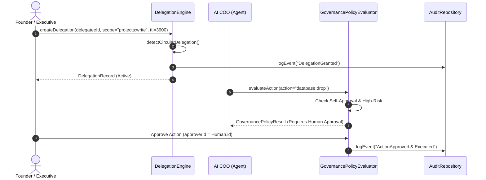

# 🤖 PAL AI Executive Governance & Delegation Architecture

**Document ID**: PAL-ARCH-DOC-012  
**Governing Specs**: PAL Architecture Bible Chapter 24, PAL-TDD-001 Chapter 9  
**Components**: `AIAgentManager`, `GovernancePolicyEvaluator`, `DelegationEngine`  
**Status**: APPROVED & IMPLEMENTED  

---

## 1. Overview & Core Governance Principles

The **AI Executive Governance & Delegation Subsystem** manages the registration, capability scoping, authority levels, human oversight, and delegation chains for all AI Executives (e.g. `ai_coo`, `ai_cfo`, `ai_ops`, `ai_sales`, `ai_marketing`, `ai_legal`, `ai_hr`).

### Core Safety Directives:
1. **No Self-Escalation**: AI agents can NEVER modify their own authority level.
2. **No Self-Approval**: AI agents can NEVER approve their own high-risk actions.
3. **No Circular Delegations**: Delegation chains forming cycles (e.g. `Human -> Agent A -> Agent B -> Agent A`) are automatically rejected.
4. **Full Attribution**: Every delegated action traces back to the originating human actor or parent executive delegation.

---

## 2. AI Executive Hierarchy & Authority Tiers

| Authority Tier | Capabilities & Limits | Approval Trigger |
|---|---|---|
| **Advisory** | Analysis, research, proposal drafting. **Zero direct execution authority**. | All proposed actions require human execution. |
| **Assisted** | Routine operations up to `$500` budget limit. | Actions exceeding `$500` or classified high-risk require human approval. |
| **Operational** | Autonomous execution up to `$1,000` (default cap) per action. | Financial wires `$5,000+` or security actions require human approval. |

---

## 3. Human-to-AI and AI-to-AI Delegation Flow

---

## 4. Circular Delegation Prevention Logic

Before issuing any delegation `Delegator -> Delegatee`, the `DelegationEngine` traverses all active delegation chains in memory. If a path already exists from `Delegatee -> Delegator`, the request is immediately aborted with a `GOVERNANCE_CIRCULAR_DELEGATION_BLOCKED` exception.
