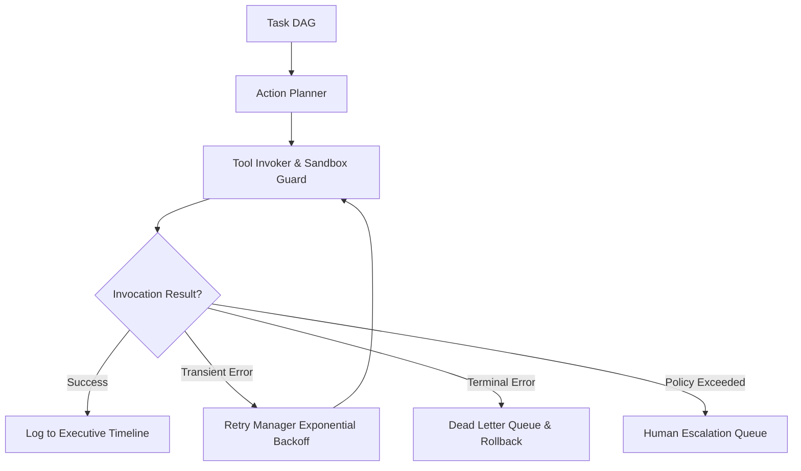

# 📚 PAL Architecture Specification — PAL-ARCH-DOC-024

## Autonomous Execution System Architecture

**Subsystem**: Autonomous Execution Engine (`PAL-TDD-003`)  
**Governing Standard**: PAL Architecture Bible v1.0 (Chapters 23, 24 & 25)  
**Status**: **APPROVED**  

---

## 1. Overview

The **Autonomous Execution System Architecture** integrates action planning, tool invocation, retry handling, rollback compensation, dead letter queue management, and human escalation into a cohesive, fault-tolerant execution engine.

---

## 2. Core Specification Rules

1. **Unified Fault Tolerant Loop**: Retries transient errors, rolls back failed multi-step DAGs, and routes policy violations to human escalation queues.
2. **Dead Letter Queue (DLQ)**: Terminal failures are enqueued with full context snapshots for post-mortem inspection.
3. **Execution Observability**: Every execution event is appended to `ExecutiveTimeline` with correlation ID `corr_...`.
