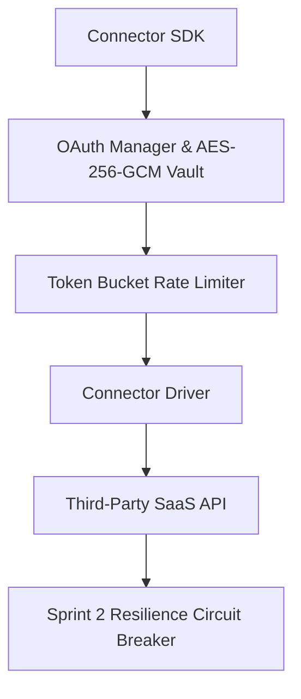

# 📚 PAL Architecture Specification — PAL-ARCH-DOC-020

## Connector Framework Architecture

**Subsystem**: Connector SDK & OAuth Manager (`PAL-TDD-003`)  
**Governing Standard**: PAL Architecture Bible v1.0 (Chapters 23, 24 & 25)  
**Status**: **APPROVED ARCHITECTURE SPECIFICATION**  

---

## 1. Overview

The **Connector Framework Architecture** details the secure driver abstractions, OAuth credential rotation, rate limiting, and health monitoring for external SaaS integrations (`Salesforce`, `HubSpot`, `Stripe`, `Google Workspace`, `GitHub`, `Slack`, `Zendesk`, `Greenhouse`, `Jira`).

---

## 2. Core Specification Rules

1. **Credential Isolation**: All OAuth tokens are encrypted at rest using AES-256-GCM via Sprint 2 `ConnectorAuthEngine` with strict tenant isolation (`workspace_id`).
2. **Automatic Token Rotation**: Refresh token rotation (RTR) is executed automatically on token expiration or 401 Unauthorized responses.
3. **Resilience & Rate Limiting**: Per-connector rate limits prevent API throttle blocks. Consecutive failures open circuit breakers to prevent cascading system outages.
