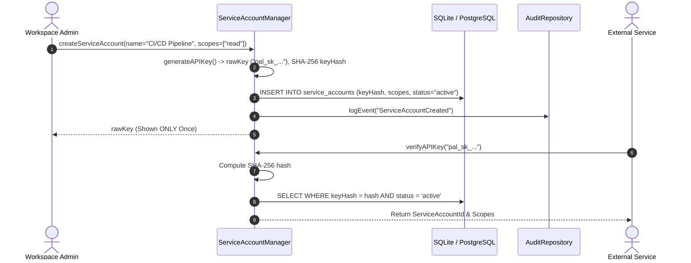

# 🔐 PAL Connector & Plugin Security Model

**Document ID**: PAL-ARCH-DOC-013  
**Governing Specs**: PAL Architecture Bible Chapter 23 & 24, PAL-TDD-001 Chapter 10  
**Components**: `ServiceAccountManager`, `ConnectorAuthEngine`, `PluginSecurityManager`  
**Status**: APPROVED & IMPLEMENTED  

---

## 1. Overview & Trust Boundaries

The **Connector & Plugin Security Subsystem** provides secure isolation for external service accounts, third-party integration connectors, and extensible plugins within PAL.

### Core Security Guarantees:
1. **Plaintext Secret Prohibition**: API keys and OAuth tokens are NEVER stored in plaintext. API keys are stored as SHA-256 hashes; OAuth tokens are encrypted using **AES-256-GCM**.
2. **Capability Sandboxing**: Plugins execute strictly within an isolated permission sandbox (`PluginSandboxContext`).
3. **Tenant Boundary Enforcement**: Service accounts, connectors, and plugins cannot access resources outside their authorized workspace.

---

## 2. Service Account API Key Lifecycle



---

## 3. Connector AES-256-GCM OAuth Token Encryption

OAuth access tokens and refresh tokens are encrypted at rest using `AES-256-GCM` with a 12-byte random Initialization Vector (IV) and 16-byte Authentication Tag.

```text
Config Payload = {
    encrypted: "<hex ciphertext>",
    iv: "<hex 12-byte IV>",
    authTag: "<hex 16-byte tag>",
    scopes: ["calendar:read", "email:send"]
}
```

---

## 4. Plugin Capability Sandboxing & Runtime Enforcement

When a plugin attempts an action:
1. `PluginSecurityManager` validates that `isApproved == true`.
2. It checks `requestedCapabilities` against the required action.
3. If unapproved or missing capability, a `PLUGIN_CAPABILITY_VIOLATION` exception is raised and logged.
