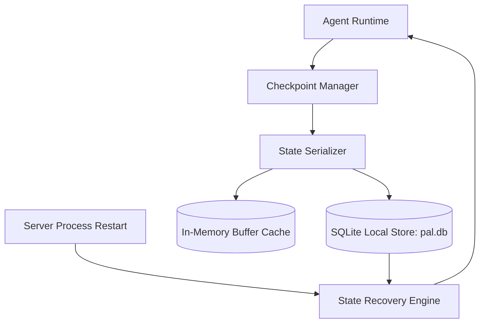

# 📚 PAL Architecture Specification — PAL-ARCH-DOC-023

## Execution Persistence & Recovery Architecture

**Subsystem**: Persistence & Checkpoint Storage (`PAL-TDD-003`)  
**Governing Standard**: PAL Architecture Bible v1.0 (Chapters 23, 24 & 25)  
**Status**: **APPROVED**  

---

## 1. Overview

The **Execution Persistence Architecture** ensures durable checkpointing, execution history tracking, job state serialization, and seamless resume-after-restart capabilities for long-running worker operations.

---

## 2. Core Specification Rules

1. **Atomic Checkpointing**: Checkpoints are written before high-risk operations, external connector calls, or human approval pauses.
2. **Idempotency Guarantees**: Restored tasks verify idempotency keys before re-executing external tool calls.
3. **Dual Storage Model**: Backed by SQLite for durability with memory caching for sub-millisecond lookups.
