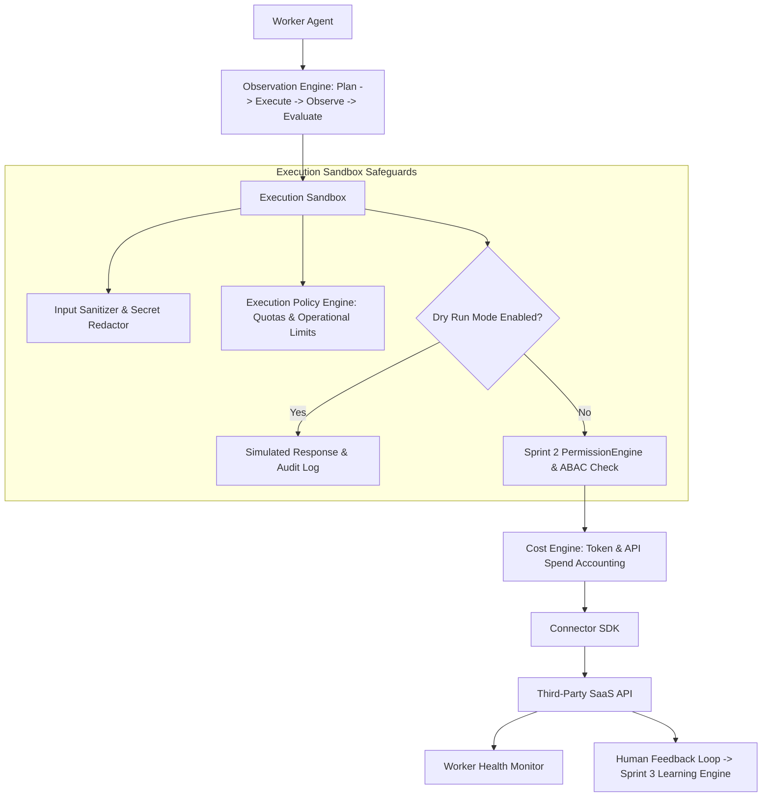

# 📚 PAL Architecture Specification — PAL-ARCH-DOC-025

## Execution Policy & Safety Model Architecture

**Subsystem**: Execution Policy & Safety Model (`PAL-TDD-003`)  
**Governing Standard**: PAL Architecture Bible v1.0 (Chapters 23, 24 & 25)  
**Status**: **APPROVED ARCHITECTURE SPECIFICATION**  

---

## 1. Overview

The **Execution Policy & Safety Model Architecture** defines the mandatory Execution Sandbox, dynamic Capability Registry, Execution Policy Engine, Cost Engine, Worker Health Monitor, Observation Loop, and Emergency Stop protocols for worker execution in Sprint 4.

---

## 2. Core Specification Rules

1. **Execution Sandbox Isolation**: No worker agent may invoke a connector directly. All tool calls MUST be routed through the `ExecutionSandbox` for parameter validation, secret redaction, quota enforcement, and permission resolution.
2. **Connector vs. Tool Hierarchy**: Connectors represent external SaaS providers (`Google Workspace`, `Stripe`), while Tools represent granular actions exposed by connectors (`Create Email`, `Refund Customer`).
3. **Execution Policy Engine**: Operational constraints (e.g., max single invoice $5,000, 100 outbound emails/day limit) are enforced separately from security permissions.
4. **Observation Engine**: Workers execute tasks in a 4-step loop (`Plan` $\rightarrow$ `Execute` $\rightarrow$ `Observe` $\rightarrow$ `Evaluate`) allowing mid-execution trajectory adaptation.
5. **Cost Accounting & Health**: Computes real-time execution costs (tokens + API calls) and tracks worker health metrics (latency, failure rate, success %).
6. **Human Feedback Loop**: Post-execution feedback (`Success?`, `Helpful?`) updates Sprint 3 `LearningEngine` confidence scores.
7. **Emergency Stop**: Global circuit kill switch halts all active worker executions instantly across tenant workspaces.
