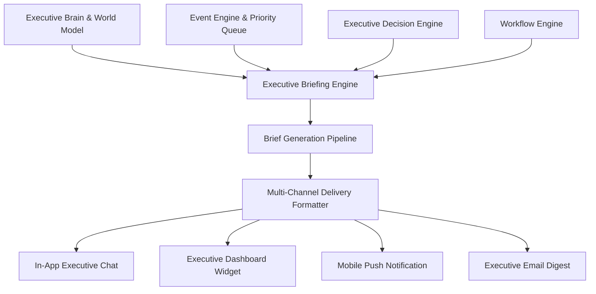

# 📚 PAL Architecture Specification — PAL-ARCH-DOC-018

## Executive Briefing & Communication Model

**Subsystem**: Executive Briefing Engine (`PAL-TDD-002`)  
**Governing Standard**: PAL Architecture Bible v1.0 (Chapters 23 & 24)  
**Status**: **APPROVED ARCHITECTURE SPECIFICATION**  

---

## 1. Subsystem Architecture Overview

The **Executive Briefing & Communication Model** provides PAL's primary proactive presentation layer. It synthesizes operational facts from the Executive Brain, active alerts from the Event Engine, decision traces from the Decision Engine, and workflow states into clear strategic summaries (`ExecutiveBrief`).

---

## 2. Executive Brief Catalog

| Brief Type | Primary Cadence | Urgency Level | Core Content |
|---|---|---|---|
| **Morning Brief (`morning`)** | Daily 08:00 | `medium` / `critical` | Runway, ARR, daily priorities, scheduled calendar meetings. |
| **Weekly Brief (`weekly`)** | Mondays 07:30 | `low` / `medium` | Quarterly OKRs, ARR trend, sprint completion, team workload. |
| **Risk Brief (`risk`)** | Immediate (on Critical Event) | `critical` | Root cause analysis, impacted connectors/projects, mitigation plan. |
| **Revenue Brief (`revenue`)** | Weekly / On Deal Event | `medium` | Pipeline velocity, active deals count, 30-day projected ARR. |
| **Operational Brief (`operational`)** | Daily 18:00 | `medium` | Deployment status, open incidents, infrastructure error rate. |
| **Decision Brief (`decision`)** | On Demand / Approval Queue | `high` | Option A/B/C trade-off comparison, score $S_d$, one-click approval buttons. |

---

## 3. Multi-Channel Presentation Layer

The `BriefingEngine` formats brief payloads natively for 4 target channels:
1. **In-App Executive Chat**: Markdown format optimized for conversational interaction.
2. **Executive Dashboard**: JSON widget schema with color-coded urgency tokens (`red`, `orange`, `blue`).
3. **Mobile Push Notifications**: Short 100-character actionable summaries.
4. **Email Digest**: Plain-text / GFM formatted executive email summaries.
