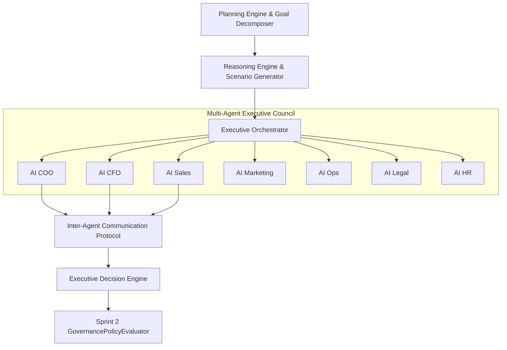

# 📚 PAL Architecture Specification — PAL-ARCH-DOC-016

## Executive Council & Decision Model

**Subsystem**: Executive Council, Executive Orchestrator & Decision Subsystem (`PAL-TDD-002`)  
**Governing Standard**: PAL Architecture Bible v1.0 (Chapters 23 & 24)  
**Status**: **APPROVED ARCHITECTURE SPECIFICATION**  

---

## 1. Subsystem Architecture Overview

The **Executive Council & Decision Model** provides domain-specialized executive intelligence coordination across 7 AI personas (`COO`, `CFO`, `Sales`, `Marketing`, `Ops`, `Legal`, `HR`) orchestrated by the `ExecutiveOrchestrator`.

---

## 2. Executive Capability Profiles

Each executive persona is defined by an immutable `ExecutiveCapabilityProfile`:
- **Identity & Title**: e.g., `ai_cfo` (AI Chief Financial Officer).
- **Domain**: Domain responsibility boundaries (`finance`, `operations`, `sales`, etc.).
- **Capabilities & Knowledge Domains**: Ingested connectors and data sources (Stripe, bank feeds, GitHub, Salesforce).
- **Authority Limits**: Financial spend limits before triggering human approval ($1,000 routine cap for COO/CFO; $0 advisory limit for Legal/HR).

---

## 3. Executive Orchestrator & Communication Protocol

The `ExecutiveOrchestrator` manages discussion rounds and consensus voting:
1. **Agent Selection**: Selects primary domain agents plus core COO/CFO agents for cross-functional governance.
2. **Timeout Enforcement**: Enforces a strict $5,000\text{ ms}$ timeout per evaluation loop.
3. **Inter-Agent Communication Bus**: Transmits structured messages containing Correlation ID (`corr_...`), intent (`consultation_request`, `consensus_vote`), evidence references, and confidence scores.
4. **Conflict Resolution Strategy**: When votes tie or confidence drops below $75\%$, the Orchestrator applies deterministic resolution defaulting to risk-mitigated balanced options and flagging low-confidence cases for human executive review.
