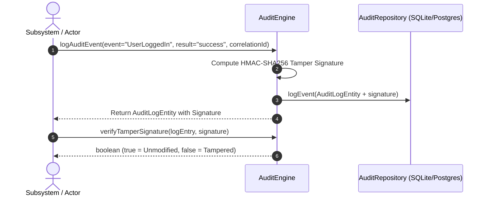
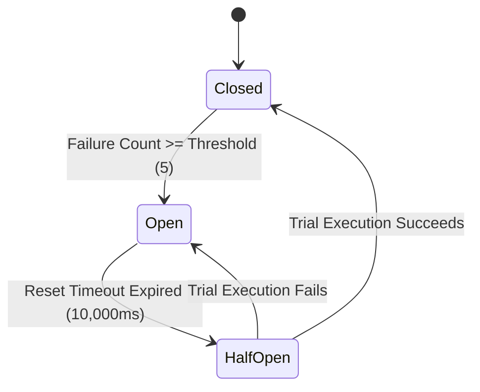

# 📈 PAL Observability, Audit & Resilience Model

**Document ID**: PAL-ARCH-DOC-014  
**Governing Specs**: PAL Architecture Bible Chapter 23 & 24, PAL-TDD-001 Chapters 13 & 14  
**Components**: `AuditEngine`, `ResilienceEngine`  
**Status**: APPROVED & IMPLEMENTED  

---

## 1. Overview & Purpose

The **Observability, Audit & Resilience Subsystem** provides end-to-end event traceability, tamper-evident audit logging, security metrics telemetry, and failure recovery primitives (Circuit Breaker, Exponential Backoff, Execution Timeouts, and Idempotency deduplication).

---

## 2. Audit Event Lifecycle & Tamper-Evident Signatures

Every security event generated by users, AI executives, connectors, plugins, or background tasks is tagged with a unique **Correlation ID** (`corr_...`) and signed using an HMAC-SHA256 signature.

---

## 3. Circuit Breaker State Machine Architecture

---

## 4. Resilience Strategy Specifications

| Primitive | Mechanism | Default Setting |
|---|---|---|
| **Circuit Breaker** | Fails fast when target downstream exceeds failure threshold to prevent cascading collapse. | Threshold: 5 failures, Reset: 10s |
| **Exponential Backoff** | Retries transient errors with exponential delay ($2^{\text{attempt}-1} \times \text{base}$). | Max Attempts: 3, Base Delay: 50ms |
| **Timeout Guard** | Rejects execution promises exceeding maximum SLA duration. | Default Timeout: Configurable per call |
| **Idempotency Store** | Caches execution outputs against unique idempotency keys for 1 hour. | Deduplication TTL: 1 hour |
