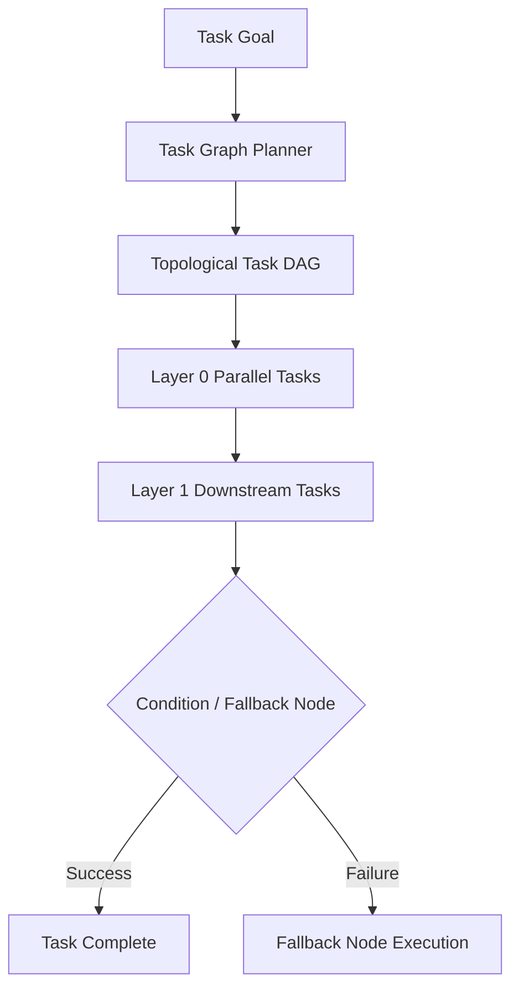

# 📚 PAL Architecture Specification — PAL-ARCH-DOC-022

## Task Graph Engine Architecture

**Subsystem**: Task Graph & Autonomous Planning (`PAL-TDD-003`)  
**Governing Standard**: PAL Architecture Bible v1.0 (Chapters 23, 24 & 25)  
**Status**: **APPROVED ARCHITECTURE SPECIFICATION**  

---

## 1. Overview

The **Task Graph Engine Architecture** governs how worker task descriptions are compiled into directed acyclic graphs (**Task DAG**), layered topolologically for parallel execution, and dynamically routed across conditional or fallback branches.

---

## 2. Core Specification Rules

1. **Topological Layering**: Nodes with satisfied prerequisites execute concurrently across worker threads.
2. **Dynamic Branching**: Supports `condition_branch` nodes for runtime predicate evaluation and `fallback_branch` nodes for tool failures.
3. **Approval Checkpoints**: Human approval nodes pause DAG execution safely without resource leaks.
