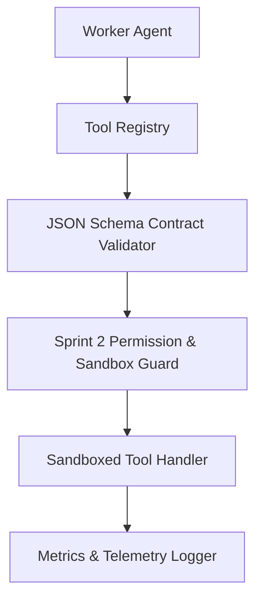

# 📚 PAL Architecture Specification — PAL-ARCH-DOC-019

## Universal Tool Architecture

**Subsystem**: Universal Tool Framework (`PAL-TDD-003`)  
**Governing Standard**: PAL Architecture Bible v1.0 (Chapters 23, 24 & 25)  
**Status**: **APPROVED ARCHITECTURE SPECIFICATION**  

---

## 1. Overview

The **Universal Tool Architecture** standardizes tool registration, schema validation, capability discovery, and sandboxed tool execution for all 9 worker agents in Sprint 4.

---

## 2. Core Specification Rules

1. **Strict Typed Contracts**: Every tool MUST define explicit JSON Schemas for input parameters and output payloads.
2. **Capability Scoping**: Tools are categorized into 9 domain buckets (`research`, `email`, `calendar`, `crm`, `finance`, `engineering`, `social`, `document`, `automation`).
3. **Zero Trust Integration**: Tool execution requires explicit permission evaluation from Sprint 2 `PermissionEngine`. High-risk tools require explicit authorization flags.
