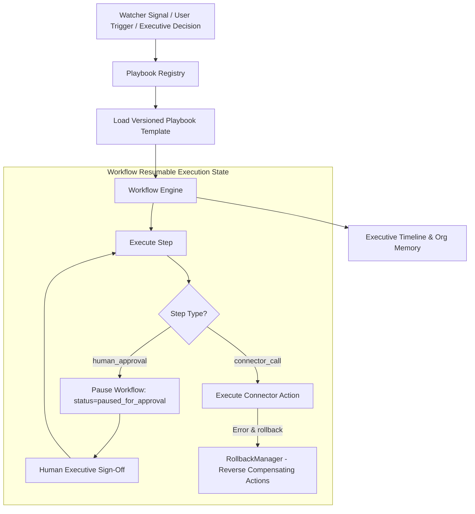

# 📚 PAL Architecture Specification — PAL-ARCH-DOC-017

## Workflow, Playbook & Event Architecture

**Subsystem**: Playbook Registry, Workflow Engine & Event Subsystem (`PAL-TDD-002`)  
**Governing Standard**: PAL Architecture Bible v1.0 (Chapters 23 & 24)  
**Status**: **APPROVED ARCHITECTURE SPECIFICATION**  

---

## 1. Subsystem Architecture Overview

The **Workflow, Playbook & Event Architecture** decouples executive business knowledge (`PlaybookRegistry`) from step-by-step execution orchestration (`WorkflowEngine`), proactive monitoring (`ExecutiveWatchers`), and organizational memory persistence (`ExecutiveTimeline`).

---

## 2. Playbook Registry & DSL Schema (`PlaybookRegistry`)

Playbooks are versioned domain assets (`sales`, `hiring`, `support`, `incident`, `fundraising`, `marketing`) supporting lifecycle states (`draft`, `active`, `deprecated`, `archived`).

### Step Action Types:
1. `connector_call`: Integrates directly with SaaS APIs behind Sprint 2 provider abstractions.
2. `ai_reasoning`: Triggers scenario formulation or decision scoring.
3. `human_approval`: Pauses workflow execution asynchronously for human executive review.
4. `condition_branch`: Evaluates runtime boolean predicates.

---

## 3. Workflow Resumable Execution & Approval Lifecycle (`WorkflowEngine`)

Each workflow instance persists step progress (`currentStepIndex`), executed outputs, approval states, and correlation IDs (`corr_...`).

When a `human_approval` step is encountered, `WorkflowEngine` transitions to `paused_for_approval` state. Execution resumes asynchronously upon receiving `approveWorkflowStep(instanceId, approverId)` sign-off.

---

## 4. Compensation Rollback Strategy (`RollbackManager`)

If an unrecoverable failure occurs mid-workflow, `RollbackManager` executes compensating actions defined in reverse step order to guarantee system state consistency.
