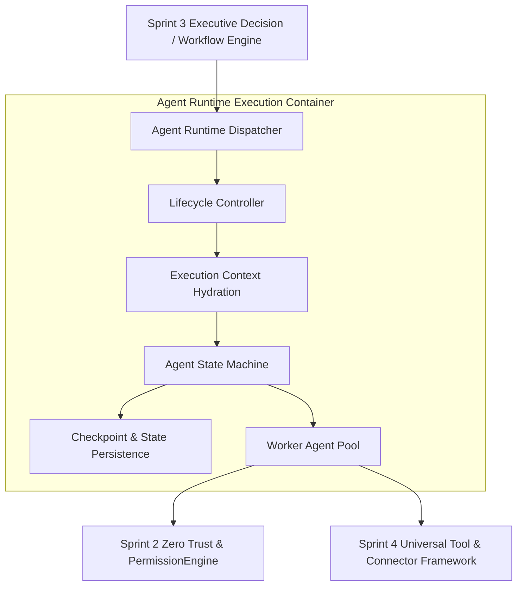
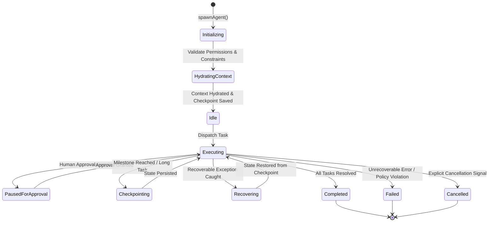

# 📑 PAL-TDD-003 – Autonomous Execution Engine & Worker Subsystem

## Part 1: Agent Runtime & Execution Architecture

**Governing Standard**: PAL Architecture Bible v1.0 (Chapters 23, 24 & 25)  
**Prerequisite Systems**: Sprint 2 (Zero Trust Security, RBAC+ABAC, AI Governance), Sprint 3 (Executive Intelligence Layer, Decision Engine, Workflow Engine)  
**Status**: **DRAFT FOR ARCHITECTURE REVIEW**  

---

### 1.1 Executive System Overview

Where Sprint 3 created PAL's **Executive Intelligence Layer** (Cognitive Brain, Planning, Reasoning, Executive Council, Decision Engine), Sprint 4 delivers PAL's **Autonomous Execution Engine & Worker Subsystem**. 

The Agent Runtime provides an isolated, resilient, stateful, and observable environment for executing worker agents autonomously while maintaining continuous alignment with Sprint 2 Zero Trust security policies and Sprint 3 executive governance controls.



---

### 1.2 Agent Runtime Architecture

The **Agent Runtime (`AgentRuntime`)** is the primary execution orchestrator for worker agents. It exposes standardized APIs for spawning, monitoring, pausing, resuming, cancelling, and recovering long-running agent execution tasks.

```typescript
export interface IAgentRuntime {
    spawnAgent(request: SpawnAgentRequest): Promise<AgentInstance>;
    getAgentInstance(instanceId: string): AgentInstance | undefined;
    pauseAgent(instanceId: string, reason: string): Promise<AgentInstance>;
    resumeAgent(instanceId: string): Promise<AgentInstance>;
    cancelAgent(instanceId: string, reason: string): Promise<AgentInstance>;
    checkpointState(instanceId: string): Promise<AgentStateCheckpoint>;
    recoverAgent(instanceId: string, checkpointId: string): Promise<AgentInstance>;
}
```

---

### 1.3 Agent Execution Lifecycle

Every worker agent instance follows a strictly deterministic lifecycle state machine:



#### Lifecycle States:
1. `Initializing`: Validates agent manifests, workspace tenant isolation, and RBAC/ABAC token scopes.
2. `HydratingContext`: Loads historical agent memory, active workspace credentials, and tool schemas.
3. `Idle`: Waiting in the worker execution queue for task assignment.
4. `Executing`: Actively running plan steps, invoking tools, or reasoning.
5. `PausedForApproval`: Paused awaiting human executive sign-off for actions exceeding budget or risk thresholds.
6. `Checkpointing`: Persisting serialized state snapshots to durable storage.
7. `Recovering`: Attempting auto-recovery from the last verified checkpoint following a transient failure.
8. `Completed`: Task finished clean with verified output traces.
9. `Failed`: Terminal state after exhausting retries or encountering an unrecoverable security/governance violation.
10. `Cancelled`: Interrupted via explicit user or system cancellation request.

---

### 1.4 Execution Context & Token Budgeting

Every agent invocation is wrapped in an isolated `ExecutionContext` object containing immutable tenant metadata, governance limits, and token budgets:

```typescript
export interface ExecutionContext {
    instanceId: string;
    workspaceId: string;
    correlationId: string;
    agentId: string;
    workerRole: WorkerRoleType;
    tenantIsolationToken: string;
    securityProfile: {
        userId: string;
        roles: string[];
        grantedPermissions: string[];
        maxBudgetPerAction: number;
        isHighRiskAllowed: boolean;
    };
    tokenBudget: {
        maxInputTokens: number;
        maxOutputTokens: number;
        consumedInputTokens: number;
        consumedOutputTokens: number;
    };
    environmentVariables: Record<string, string>;
    createdAt: number;
}
```

---

### 1.5 State Checkpoints & Durable Recovery

To guarantee fault tolerance during long-running tasks or system restarts, the runtime saves immutable state checkpoints:

1. **Automatic Checkpointing**: Saved prior to executing any high-risk tool invocation, external connector API call, or human approval node.
2. **Incremental State Snapshots**: Captures memory delta, active task index, variables, and tool invocation history.
3. **Recovery Sequence**:
   - On runtime failure, `AgentRuntime` inspects the last valid `AgentStateCheckpoint`.
   - Re-hydrates state variables and execution context.
   - Evaluates idempotency keys to prevent duplicate external side-effects.
   - Resumes execution seamlessly at the failed step.

---

### 1.6 Long-Running Task Management & Cancellation Protocols

- **Heartbeat Signals**: Running agents emit heartbeats every 5,000ms. If a heartbeat is missed for $> 15,000\text{ms}$, the runtime flags the agent as `degraded` and triggers health checks.
- **Graceful Cancellation (`AbortController`)**:
  - Emits `SIGINT` equivalent cancellation signal.
  - Allows current atomic tool call to complete or roll back cleanly.
  - Persists cancellation audit event to `AuditEngine` with correlation ID `corr_...`.
