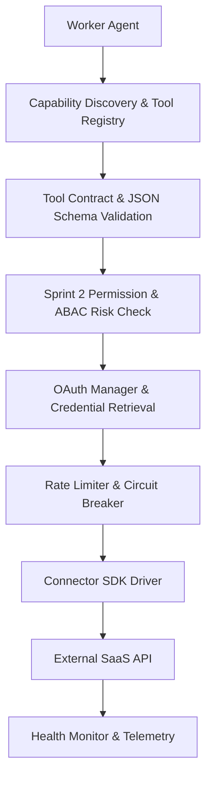

# 📑 PAL-TDD-003 – Autonomous Execution Engine & Worker Subsystem

## Part 2: Universal Tool & Connector Framework

**Governing Standard**: PAL Architecture Bible v1.0 (Chapters 23, 24 & 25)  
**Prerequisite Systems**: Sprint 2 Connector Auth Engine & Plugin Sandbox, Sprint 4 Agent Runtime  
**Status**: **DRAFT FOR ARCHITECTURE REVIEW**  

---

### 2.1 Universal Tool Framework Architecture

The **Universal Tool & Connector Framework** standardizes how worker agents discover, authenticate, validate, invoke, and monitor external tools and SaaS integrations.



---

### 2.2 Tool Registry & Tool Contracts (`ToolRegistry`)

Every tool exposed to worker agents must be registered in the centralized `ToolRegistry` with strict typed input/output contracts defined via JSON Schema:

```typescript
export type ToolCategory = "research" | "email" | "calendar" | "crm" | "finance" | "engineering" | "social" | "document" | "automation";

export interface ToolContract {
    toolId: string;
    name: string;
    description: string;
    category: ToolCategory;
    version: string;
    provider: string;
    requiredPermissions: string[];
    isHighRisk: boolean;
    estimatedCostUSD: number;
    rateLimitPerMinute: number;
    inputSchema: Record<string, any>; // JSON Schema
    outputSchema: Record<string, any>; // JSON Schema
}

export interface IToolRegistry {
    registerTool(contract: ToolContract, handler: ToolExecutionHandler): void;
    getTool(toolId: string): ToolContract | undefined;
    listTools(category?: ToolCategory, grantedPermissions?: string[]): ToolContract[];
    executeTool(toolId: string, params: Record<string, any>, context: ExecutionContext): Promise<ToolExecutionResult>;
}
```

---

### 2.3 Connector SDK & OAuth Manager (`ConnectorSDK`)

The `ConnectorSDK` provides standardized driver abstractions for third-party SaaS tools (`Salesforce`, `HubSpot`, `Stripe`, `Google Workspace`, `GitHub`, `Slack`, `Zendesk`, `Greenhouse`, `Jira`).

#### OAuth Manager (`OAuthManager`):
- Handles OAuth2 PKCE flow, refresh token auto-rotation, and AES-256-GCM token storage via Sprint 2 `ConnectorAuthEngine`.
- Enforces strict tenant workspace isolation (`workspace_id`).
- Automatically intercepts `$401$ Unauthorized` responses to refresh credentials before raising errors.

---

### 2.4 Capability Discovery & Permission Scoping

Worker agents query `ToolRegistry.listTools(category, permissions)` at runtime to dynamically discover accessible tools:
1. **Dynamic Capability Match**: An agent with role `crm_worker` discovers `crm.create_deal`, `crm.update_lead`, and `crm.enrich_account`.
2. **Permission Boundary Filter**: If an agent lacks the `crm.delete` permission, `ToolRegistry` filters out destructive tools from the agent's available toolset.

---

### 2.5 Rate Limiting, Circuit Breakers & Health Monitoring

- **Token Bucket Rate Limiter**: Enforces per-minute and per-hour API rate limits for each connector (e.g., Salesforce max 100 requests/min).
- **Circuit Breaker Integration**: Leverages Sprint 2 `ResilienceEngine`. If a connector fails 3 consecutive times, its circuit opens for 30 seconds to prevent cascading failures.
- **Telemetry & Health Metrics**: Tracks execution latency (p95/p99), HTTP status codes, and payload sizes.
