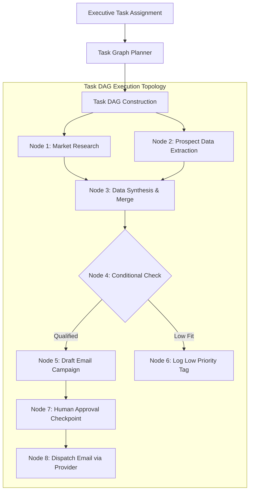

# 📑 PAL-TDD-003 – Autonomous Execution Engine & Worker Subsystem

## Part 3: Task Graph & Autonomous Planning

**Governing Standard**: PAL Architecture Bible v1.0 (Chapters 23, 24 & 25)  
**Prerequisite Systems**: Sprint 3 Planning Engine & Goal Decomposer, Sprint 4 Agent Runtime  
**Status**: **DRAFT FOR ARCHITECTURE REVIEW**  

---

### 3.1 Task Graph Architecture (`TaskDAG`)

While Sprint 3's `PlanningEngine` breaks high-level executive objectives into strategic milestones, Sprint 4's **Task Graph Engine (`TaskGraphEngine`)** compiles tactical worker instructions into an executable, directed acyclic graph (**Task DAG**).



---

### 3.2 Task DAG Node Types & Schema

Each node in a `TaskDAG` represents an atomic operation:

```typescript
export type TaskNodeType = "tool_call" | "agent_reasoning" | "parallel_group" | "condition_branch" | "human_approval" | "subgraph_call";

export interface TaskNode {
    nodeId: string;
    title: string;
    type: TaskNodeType;
    assignedWorkerRole: WorkerRoleType;
    toolId?: string;
    inputParameters: Record<string, any>;
    prerequisites: string[]; // Node IDs that must complete first
    retryPolicy: {
        maxRetries: number;
        backoffFactorMs: number;
    };
    timeoutMs: number;
    onFailure: "retry" | "fallback_branch" | "escalate_to_human" | "halt_dag";
    fallbackNodeId?: string;
}

export interface TaskDAG {
    dagId: string;
    workspaceId: string;
    correlationId: string;
    goalDescription: string;
    nodes: Map<string, TaskNode>;
    executionOrder: string[][]; // Groups of nodes that can execute in parallel
    createdAt: number;
}
```

---

### 3.3 Dependency Resolution & Parallel Execution Planner

The `TaskGraphEngine` resolves prerequisites and computes optimal topological execution layers:
1. **Topological Layering**: Nodes with zero prerequisites form Layer 0. Nodes depending only on Layer 0 form Layer 1, enabling parallel execution across worker agent threads.
2. **Dynamic Parallel Dispatch**: Layer 0 nodes execute concurrently. As each node finishes, downstream node dependency counters decrement until triggered.

---

### 3.4 Conditional & Retry Branches

- **Condition Nodes (`condition_branch`)**: Evaluates boolean predicates against upstream outputs (e.g. `lead.employeeCount > 500`). Dynamically prunes unselected graph branches.
- **Retry & Fallback Branches (`fallback_branch`)**: If a primary tool node fails after maximum retries (e.g. Clearbit API down), the DAG dynamically reroutes execution to a fallback node (e.g. ZoomInfo connector).

---

### 3.5 Human Approval Checkpoints

Any node marked `human_approval` or involving financial spend above budget limits pauses DAG execution:
- DAG status transitions to `paused_for_approval`.
- An approval card is submitted to Sprint 2/3 `ApprovalQueueWidget`.
- Upon receipt of `approveTaskNode(nodeId, approverId)`, the engine marks the node completed and resumes downstream execution.
