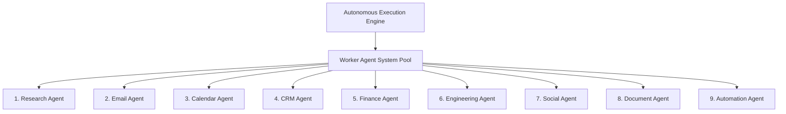

# 📑 PAL-TDD-003 – Autonomous Execution Engine & Worker Subsystem

## Part 4: Worker Agent System

**Governing Standard**: PAL Architecture Bible v1.0 (Chapters 23, 24 & 25)  
**Prerequisite Systems**: Sprint 3 Executive Council (7 Personas), Sprint 4 Universal Tool Framework  
**Status**: **DRAFT FOR ARCHITECTURE REVIEW**  

---

### 4.1 Executive vs. Worker Distinction Architecture

A fundamental architectural principle of PAL is the separation between **Executive Personas** (Sprint 3) and **Worker Agents** (Sprint 4):

| Dimension | Executive Personas (Sprint 3) | Worker Agents (Sprint 4) |
|---|---|---|
| **Role & Scope** | Strategic reasoning, scenario evaluation, voting, decision guidance. | Tactical task execution, tool invocation, data processing, API calls. |
| **Tool Access** | Read-only context queries & high-level decision scoring. | Direct tool & connector invocation (`HubSpot`, `Stripe`, `GitHub`, `Gmail`). |
| **Execution Horizon** | Long-term quarterly/sprint goals & multi-option trade-offs. | Short-term tactical task DAGs & atomic steps. |
| **Authority Model** | Formulates recommendations; defers to human executive sign-off. | Bound by strict RBAC/ABAC tool permissions and action budget caps. |

---

### 4.2 The 9 Specialized Worker Agents

Sprint 4 introduces **9 domain-specialized worker agents**:



#### Detailed Worker Specifications:

1. **Research Agent (`ResearchWorker`)**:
   - *Domain*: Web search, company firmographics, competitive intelligence, paper synthesis.
   - *Primary Tools*: `web_search`, `domain_enrich`, `web_scrape`, `pdf_extract`.
2. **Email Agent (`EmailWorker`)**:
   - *Domain*: Email drafting, inbox processing, outbound campaign dispatch, follow-up sequencing.
   - *Primary Tools*: `gmail.send_email`, `sendgrid.dispatch_campaign`, `email.parse_thread`.
3. **Calendar Agent (`CalendarWorker`)**:
   - *Domain*: Schedule optimization, meeting booking, conflict resolution, agenda preparation.
   - *Primary Tools*: `google_calendar.find_slot`, `google_calendar.create_event`, `cal_com.book`.
4. **CRM Agent (`CRMWorker`)**:
   - *Domain*: Lead qualification, deal stage updates, pipeline hygiene, account enrichment.
   - *Primary Tools*: `salesforce.create_lead`, `hubspot.update_deal`, `clearbit.enrich`.
5. **Finance Agent (`FinanceWorker`)**:
   - *Domain*: Invoice reconciliation, expense auditing, payment status checks, burn rate tracking.
   - *Primary Tools*: `stripe.fetch_charges`, `quickbooks.create_invoice`, `bank.get_balance`.
6. **Engineering Agent (`EngineeringWorker`)**:
   - *Domain*: Codebase inspection, PR reviews, issue triage, CI/CD status monitoring.
   - *Primary Tools*: `github.create_pr`, `github.list_issues`, `sentry.fetch_errors`.
7. **Social Agent (`SocialWorker`)**:
   - *Domain*: Content distribution, social listening, engagement tracking, brand sentiment.
   - *Primary Tools*: `twitter.post_tweet`, `linkedin.publish_post`, `social.fetch_mentions`.
8. **Document Agent (`DocumentWorker`)**:
   - *Domain*: Report generation, contract parsing, PDF creation, markdown rendering.
   - *Primary Tools*: `google_docs.create`, `pdf.generate_report`, `markdown.compile`.
9. **Automation Agent (`AutomationWorker`)**:
   - *Domain*: Multi-step web workflows, script execution, data format translation, webhook triggering.
   - *Primary Tools*: `webhook.trigger`, `json.transform`, `script.execute_sandboxed`.

---

### 4.3 Worker Agent Interface Definition

All 9 worker agents implement the unified `IWorkerAgent` interface:

```typescript
export type WorkerRoleType = "research" | "email" | "calendar" | "crm" | "finance" | "engineering" | "social" | "document" | "automation";

export interface WorkerExecutionRequest {
    taskId: string;
    workspaceId: string;
    correlationId: string;
    taskDescription: string;
    inputParameters: Record<string, any>;
    context: ExecutionContext;
}

export interface WorkerExecutionResponse {
    taskId: string;
    status: "success" | "failed" | "requires_approval";
    outputData: Record<string, any>;
    invokedTools: string[];
    consumedTokens: { input: number; output: number };
    errorDetails?: string;
}

export interface IWorkerAgent {
    getWorkerRole(): WorkerRoleType;
    getCapabilities(): string[];
    executeTask(request: WorkerExecutionRequest): Promise<WorkerExecutionResponse>;
}
```
