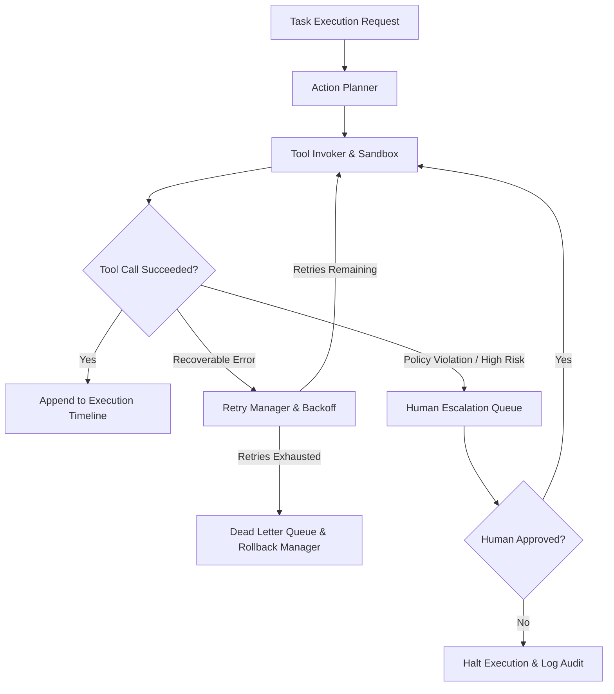
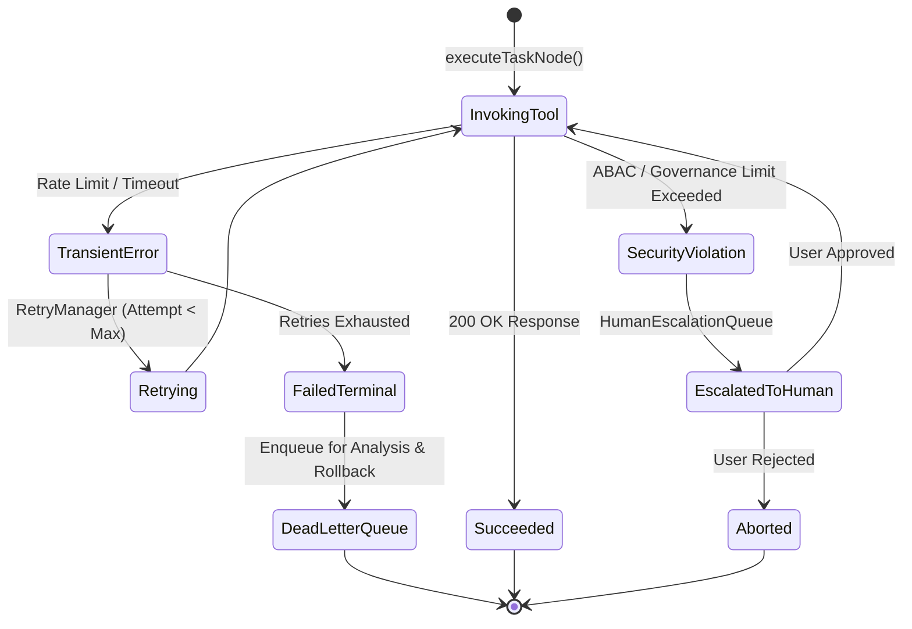

# 📑 PAL-TDD-003 – Autonomous Execution Engine & Worker Subsystem

## Part 5: Autonomous Execution Engine

**Governing Standard**: PAL Architecture Bible v1.0 (Chapters 23, 24 & 25)  
**Prerequisite Systems**: Sprint 4 Agent Runtime, Tool Registry, Task Graph Engine, Worker Agents  
**Status**: **DRAFT FOR ARCHITECTURE REVIEW**  

---

### 5.1 Autonomous Execution Engine Architecture

The **Autonomous Execution Engine (`AutonomousExecutionEngine`)** orchestrates end-to-end task execution. It binds action planning, tool invocation, retry handling, rollback compensation, dead letter queue management, and human escalation into a unified engine.

---

### 5.2 Core Components & Subsystem Responsibilities

1. **Action Planner (`ActionPlanner`)**: Receives DAG tasks, selects the appropriate `IWorkerAgent` based on `assignedWorkerRole`, and validates parameter bindings.
2. **Tool Invoker (`ToolInvoker`)**: Wraps tool executions in Sprint 2 sandboxes (`PluginSecurityManager`), validating ABAC constraints and input/output JSON schemas.
3. **Retry Manager (`RetryManager`)**: Handles transient network/rate-limit errors using exponential backoff with jitter (`backoffFactorMs * 2^attempt + jitter`).
4. **Rollback Manager (`RollbackManager`)**: Executes compensating step actions in reverse topological order if a multi-step DAG encounters terminal failure.
5. **Dead Letter Queue (`DeadLetterQueue`)**: Captures unrecoverable task failures with full payload snapshots, stack traces, and correlation IDs for post-mortem analysis.
6. **Execution Timeline (`ExecutionTimeline`)**: Emits structured execution telemetry events to Sprint 3 `TimelineEngine` for audit and replay.
7. **Human Escalation Queue (`HumanEscalationQueue`)**: Intercepts actions requiring human sign-off, pausing task execution safely.

---

### 5.3 Failure Recovery & Human Escalation Lifecycle

